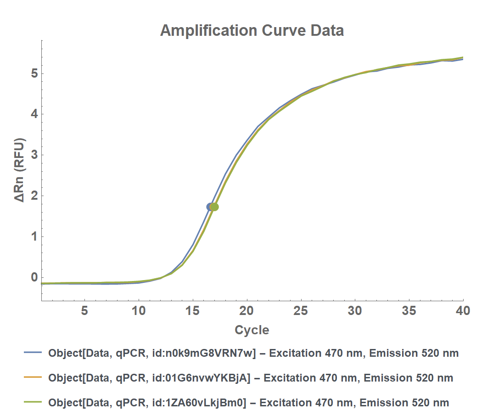
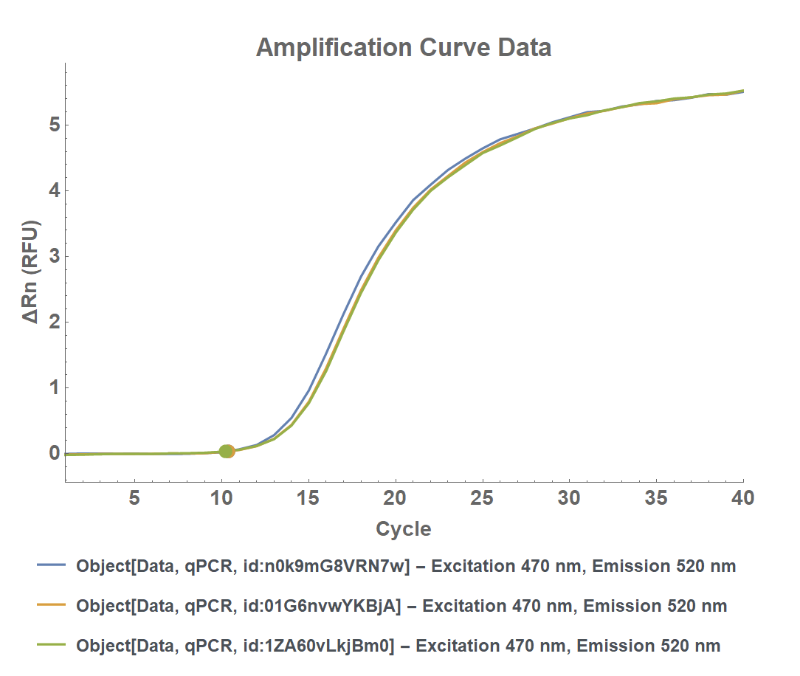

[HOME](/README.md)

# ExperimentqPCR


### Notes
- Default settings can easily lead to a failed experiment if they don't match the chosen Master Mix. Confirm settings against the Master Mix protocol to be sure.
- Parameters that must typically be set by the user, based on the desired Master Mix:
  - `MeltingCurveTime`: defaults to 2333s, which won't mess up your experiment but may not be desirable
  - `ActivationTime`: default of 1 minute may not be long enough to activate the polymerase in the Master Mix
  - `ExtensionTime`
  - `DenaturationTime`

### Example 1 - Multiple Samples

```mathematica
(* Define Primers and Samples *)
forwardPrimer5 = Object[Sample, "id:bbb"];
reversePrimer5 = Object[Sample, "id:ccc"];
myPrimerPairs = { { {forwardPrimer5, reversePrimer5} },{ {forwardPrimer5, reversePrimer5} } };
mySamples = {Object[Sample,"id:zzz"],Object[Sample,"id:aaa"]};
masterMix = Model[Sample, "Power SYBR Green PCR Master Mix"];

(* Protocol *)
myExperimentqPCR = ExperimentqPCR[
	mySamples,
	myPrimerPairs,
	MasterMix -> masterMix,
	NumberOfReplicates -> 3,
	ActivationTime -> 10 Minute,
	ExtensionTemperature -> 60 Celsius,
	MeltingCurveTime -> 233 Second,
	DenaturationTime -> 60 Second,
	Name -> "qPCR Experiment 001"
]
```

## Analysis
### Notes
- Default `BaselineDomain` range may lead to incorrect analysis of the Quantification Cycle. If initial analysis results in a Quantification Cycle that occurs in the middle of the amplification curve, reduce the upper range value.
- After executing `AnalyzeQuantificationCycle[]`, re-run `PlotObject[]` to see the Quantification Cycle show up on the plot (as a large dot).

### Example 1
```mathematica
(* Analyze Quantification Cycle *)
AnalyzeQuantificationCycle[
    myExperimentqPCR,
    BaselineDomain -> {3 Cycle, 8 Cycle}
]

(* Plot Amplification Curve *)
PlotObject[myExperimentqPCR[Data]]
```

Incorrect Quantification Cycle



Corrected Quantification Cycle


---
[HOME](/README.md)

<sub>©2022 Ryan Nelson. All rights reserved.</sub>